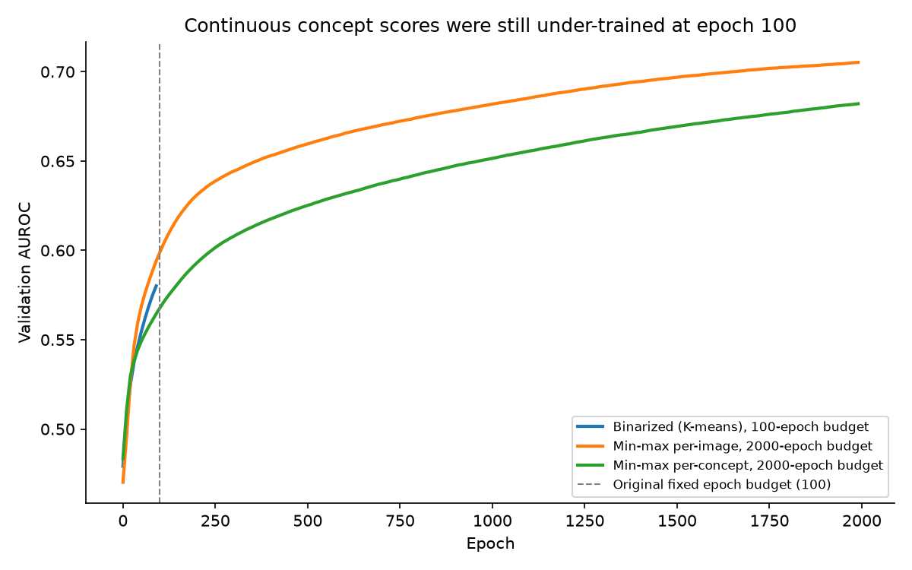

# cbm-chest-xray

Can a small, hand-curated radiology vocabulary and an off-the-shelf biomedical vision-language model (BiomedCLIP) build an interpretable concept-bottleneck chest X-ray classifier, without training a custom encoder — and how close does that get to a plain linear model with no concept layer at all?

**Status:** this is a live, ongoing project. The training-budget fix and the resulting change in ranking (described below) have been confirmed two ways: the notebook itself has the corrected output saved, and the same result was reproduced independently with a fully converged `sklearn.LogisticRegression` fit on the same data. What has not yet been done: testing on the full CheXpert dataset, testing on data from outside CheXpert, and repeating the experiment with multiple random seeds.

**Main finding:** on a ~10,000-row subsample of CheXpert, continuous concept scores trained with a properly converged linear model outperformed both a binarized version of the same concept bottleneck and a baseline with no concept bottleneck at all. This is a preliminary result from one data split and has not yet been confirmed at full scale.

## Why this matters

A chest X-ray classifier that only outputs a probability gives a clinician no way to check its reasoning. A concept bottleneck model (CBM) instead predicts a label from a small set of named, human-readable concepts (for example, "widened mediastinal silhouette" or "boot shaped heart"), so a person can see which concepts drove a given prediction. The tradeoff is that squeezing all information through a small set of named concepts can lose signal compared to a model that uses a full, uninterpretable embedding.

## Research question

Building a full CBM from scratch usually means training a custom vision-language encoder on a large set of medical images and reports. This project asks a narrower question: can a CBM be built cheaply instead, using an off-the-shelf encoder (BiomedCLIP) and a small, manually written concept list, and still preserve enough signal to be worth the interpretability it buys?

## Experimental setup

Chest X-ray images and short concept phrases (such as "pleural thickening") are each encoded into the same embedding space using BiomedCLIP, a biomedical vision-language model that was not fine-tuned for this project. Each image gets a similarity score against every concept, based on cosine similarity in that shared embedding space. Those similarity scores are then turned into an input for a classifier in one of three ways (described in "Models compared" below). A single linear layer is trained to predict 14 CheXpert disease labels from that input.

All experiments use a fixed subsample of about 10,000 rows from CheXpert, split by patient (not by image) into 80% training, 10% validation, and 10% test, so that no patient appears in more than one split.

## Concept vocabulary and leakage safeguards

The 95 concepts used here were built from a larger candidate list in four steps: removing exact duplicates, removing concepts that were too long to be a short observational phrase, removing any concept whose meaning was too close to one of the 14 target label names, and removing near-duplicate concepts that would otherwise compete for the same information. The label-similarity step matters most for validity: without it, a concept could just restate the label itself (for example, a concept literally named "cardiomegaly"), which would let the model "cheat" by encoding the answer directly instead of learning a genuine visual relationship.

## Models compared

Four models are trained and compared, all as a single linear layer on top of a fixed input:

| Model | Input to the linear layer |
|---|---|
| Baseline | The raw 512-dimensional BiomedCLIP image embedding, with no concept layer |
| Binarized | Each of the 95 concept scores turned into a 0 or 1, using K-means clustering |
| Min-max (per image) | Each image's own 95 concept scores rescaled to the 0–1 range relative to each other |
| Min-max (per concept) | Each concept's scores rescaled to the 0–1 range using statistics from the training set only |

## Initial unexpected result

The first run came back backwards. Continuous concept scores were expected to beat a binarized cut, since binarizing throws away information. Instead, both continuous versions scored *worse* on the test set:

| Model | Test AUROC (average across 14 labels) |
|---|---|
| Baseline | 0.628 |
| Binarized | 0.603 |
| Min-max (per concept) | 0.585 |
| Min-max (per image) | 0.578 |

## Investigation and convergence fix

Before accepting this result, four checks were run to rule out a bug:

- The rescaling code was checked line by line for a mistake in which direction it averages over (row-wise vs. column-wise), and for any leakage of test-set statistics into training. Neither was found.
- The actual saved data files were checked directly, not just the code that produced them: fewer than 0.5% of test-set values fell outside the range set by the training data for any concept, which rules out a leakage-driven distortion.
- The 95 concepts were checked by hand against the 14 target labels. They were well matched to the labels (for example, "boot shaped heart" is a known sign of Cardiomegaly, and "deep sulcus sign" is a known sign of Pneumothorax), which weakens the idea that the concepts themselves were simply uninformative.
- The same three input types were re-trained outside the notebook using a different solver (`sklearn.LogisticRegression`, which always trains to full convergence) instead of the fixed-length training loop used in the notebook. This reversed the result: both continuous models clearly beat the binarized model once they were actually given enough training to converge.

That last check identified the real cause. The notebook's shared training function used a fixed learning rate and a fixed number of training steps (100) for every model. The continuous concept scores have lower variance than the binarized 0/1 scores, so the same learning rate moved the continuous models' weights more slowly — they simply had not finished training within 100 steps, while the binarized model had. The fix: the two continuous models now train for up to 2,000 steps with early stopping once their validation score stops improving; the binarized model and the baseline keep their original 100-step budget, since they were already fully trained within it.

## Results

| Model | Test AUROC (average across 14 labels) |
|---|---|
| Min-max (per concept) | 0.681 |
| Min-max (per image) | 0.680 |
| Baseline | 0.628 |
| Binarized | 0.603 |


*(regenerate with `python figures/generate_auroc_comparison.py`)*

The improvement is visible directly in the training logs: the binarized model's validation score levels off by step 100, while both continuous models are still improving well past that point.


*(regenerate with `python figures/generate_convergence_curves.py`)*

## Interpretation

Once trained properly, both continuous concept models beat the no-bottleneck baseline. In other words, on this data split, using a concept bottleneck did not cost any accuracy compared to a model with no bottleneck at all — a result that runs against the usual assumption that interpretability comes at an accuracy cost. This is based on a single data split with no repeated seeds, so it should be read as a promising signal rather than a settled conclusion; see Limitations.

## Limitations

This uses one train/validation/test split, not an average over multiple random seeds, so the small gap between the two continuous models (0.681 vs. 0.680) is likely within normal run-to-run noise and should not be read as one model being reliably better than the other. All results come from a roughly 10,000-row subsample of CheXpert chosen for faster iteration, not the full dataset, and have not been checked against data from outside CheXpert. No confidence intervals are reported.

## Repository guide

- `notebooks/01_concept_curation.ipynb` — builds the 95-concept vocabulary from a candidate list.
- `notebooks/02_cbm_pipeline.ipynb` — the full pipeline: image and concept encoding, all four models, evaluation, and the interpretability walkthrough.
- `data/` — the concept vocabulary before and after filtering.
- `results/` — the AUROC comparison table shown above, as a CSV file.
- `figures/` — the two figures above, plus the scripts that generate them from the results and the notebook's saved output.
- `scripts/` — setup scripts for downloading BiomedCLIP and preparing the CheXpert data (see below).

## Reproducing this work

```
pip install -r requirements.txt
```

The raw CheXpert images and the BiomedCLIP model are not included in this repository and must be downloaded separately. See [PREREQUISITES.md](PREREQUISITES.md) for exact steps, or run `bash scripts/download_data.sh` from the `notebooks/` folder directly. CheXpert is downloaded from the [`danjacobellis/chexpert`](https://huggingface.co/datasets/danjacobellis/chexpert) mirror on Hugging Face, not Stanford's own gated release.

## Next steps

The most direct follow-up is to repeat this experiment with several random seeds to check whether the ranking between the two continuous models is stable or just noise, and then to re-run it on the full CheXpert dataset instead of the 10,000-row subsample. Testing on a dataset other than CheXpert would also show whether the result holds outside the data it was found on. Separately, the hyperparameter sweep run for the binarized model (Adam consistently outperformed SGD across every setting tried) has not yet been repeated for the two continuous models under their new, longer training budget.

## Related work

This project is a small-scale comparison point next to [CLEAR](https://doi.org/10.1038/s41551-026-01741-4) (Han et al., *Nature Biomedical Engineering*, 2026), a much larger, purpose-built system that pretrains its own encoder on 873,000 chest-X-ray-specific image-report pairs and uses a concept bank of about 368,000 concepts, reaching 87.0% AUROC. This project uses an off-the-shelf encoder and a concept list four orders of magnitude smaller — it is meant to explore the same idea cheaply, not to compete with CLEAR on raw performance.
