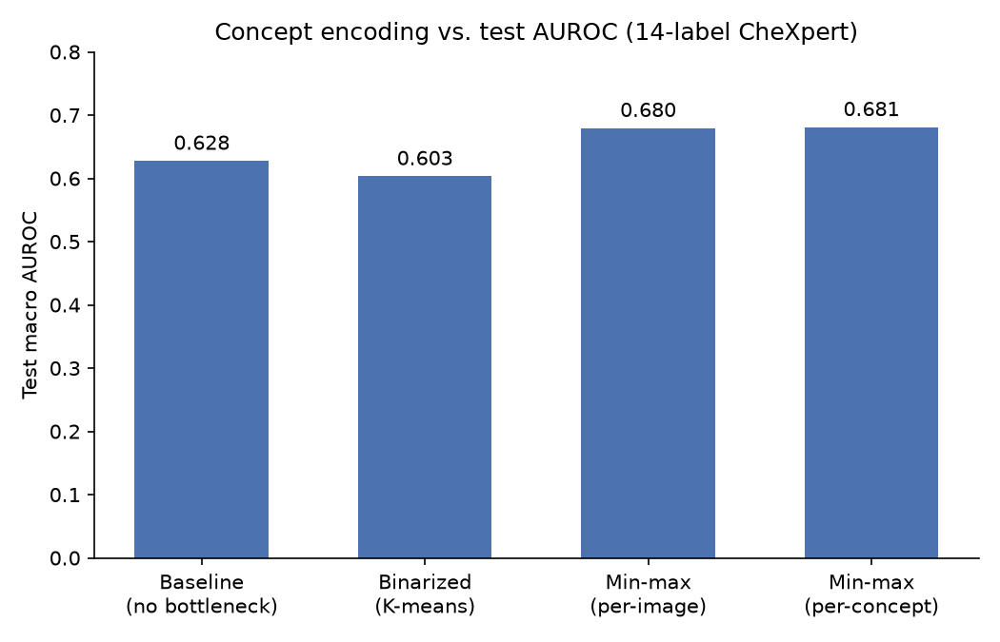

# cbm-chest-xray

Can a hand-curated, small radiology vocabulary and an off-the-shelf biomedical vision-language model (BiomedCLIP) build an interpretable concept-bottleneck chest X-ray classifier, without training a custom encoder, and how far does that get you versus a black-box baseline?

**Status:** live, ongoing project. Confirmed: the training-budget fix below and the resulting ranking flip — verified in-notebook (`02_cbm_pipeline.ipynb` has the corrected outputs saved) and independently via a converged `sklearn.LogisticRegression` re-fit on the same concept matrices. Open: this is a ~10K-row subsample for fast iteration, not yet validated at full dataset scale or on an external test set.

## Motivation

A concept bottleneck model (CBM) predicts a label from a small set of human-interpretable concept scores instead of a raw embedding — transparent, at some capacity cost. The question here: does a cheap version of this (~95 hand-curated radiology concepts, scored via off-the-shelf BiomedCLIP, no custom pretraining) preserve enough signal to be worth the bottleneck, or does it just throw information away?

## Method

Concepts are curated from a seed list: deduplicated, length-filtered, filtered to drop anything too semantically similar to one of the 14 target labels (to avoid trivially encoding the label), then deduplicated against each other. The surviving ~95 concepts are scored against every chest X-ray via cosine similarity in BiomedCLIP's shared embedding space. Three ways of encoding those raw scores are compared: binarized (per-concept 2-means K-means), per-image min-max, and per-concept min-max (fit on train, applied to val/test). Each trains its own linear layer to predict 14 CheXpert labels; a no-bottleneck baseline trains the same layer on raw BiomedCLIP embeddings.

## The twist

The first pass came back backwards — continuous scores were expected to beat a binary cut, but both continuous variants scored *worse*:

| Variant | Test macro AUROC |
|---|---|
| Baseline (no bottleneck) | 0.6276 |
| Binarized (K-means) | 0.6033 |
| Per-concept min-max | 0.5849 |
| Per-image min-max | 0.5783 |

## The investigation

- Checked the scaling code for an axis-swap or train/val/test leakage bug — found neither; each scaling variant reduces over the correct axis, and per-concept stats are fit on train only.
- Verified against the actual saved `.npy` matrices, not just the code: under 0.5% of test-set values fell outside the train-derived min/max range for any concept, ruling out leakage-driven clipping.
- Checked the 95-concept vocabulary against the 14 target labels — found it well-targeted (e.g. "boot shaped heart" → Cardiomegaly, "deep sulcus sign" → Pneumothorax), weakening the "concepts aren't predictive" theory.
- Re-fit the same three concept matrices with a solver that runs to convergence (`sklearn.LogisticRegression`, LBFGS) outside the notebook, isolating optimization from representation. This reversed the ranking — both continuous variants clearly beat binarization once actually converged.

## The fix and resolution

The shared linear probe trained at a fixed learning rate for a hardcoded 100 epochs, full-batch. Continuous concept scores have lower variance than the binarized {0,1} scores, so the same learning rate under-drove their updates within that epoch budget — the probe hadn't converged for the continuous variants. Fix: continuous variants now train up to 2000 epochs with early stopping (patience 100); binarized and baseline keep their original 100-epoch budget, since they were already converging fine. Corrected results:

| Variant | Test macro AUROC |
|---|---|
| Per-concept min-max | 0.6809 |
| Per-image min-max | 0.6795 |
| Baseline (no bottleneck) | 0.6276 |
| Binarized (K-means) | 0.6033 |



Both continuous variants now beat the raw-embedding baseline — an accuracy *gain* from the bottleneck, not the usual interpretability-for-accuracy tradeoff.

## Where this sits

Benchmarked conceptually against [CLEAR](https://doi.org/10.1038/s41551-026-01741-4) (Han et al., *Nature Biomedical Engineering*, 2026), a much larger purpose-built system trained on 873K CXR-specific image-report pairs with a ~368K-concept bank, reaching 87.0% AUROC. This project is the small-scale, reproducible, off-the-shelf point in the same design space — not a competitor on raw performance.

## Reproducing this

```
pip install -r requirements.txt
```

Raw CheXpert images and the BiomedCLIP image/text embeddings are not included in this repo and must be regenerated separately before either notebook can be run end-to-end — they are not bundled here.

## Hyperparameter sweep

One line: Adam clearly outperformed SGD across every learning rate and L1 setting tried for the binarized variant.
